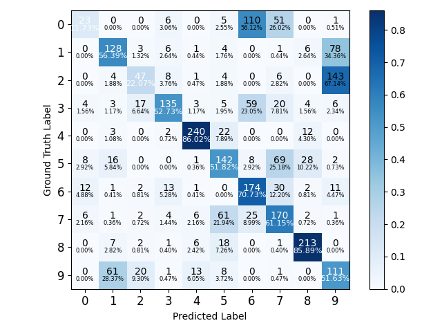
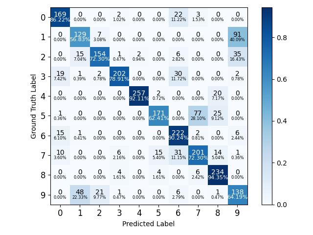
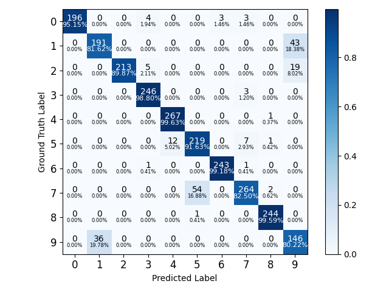
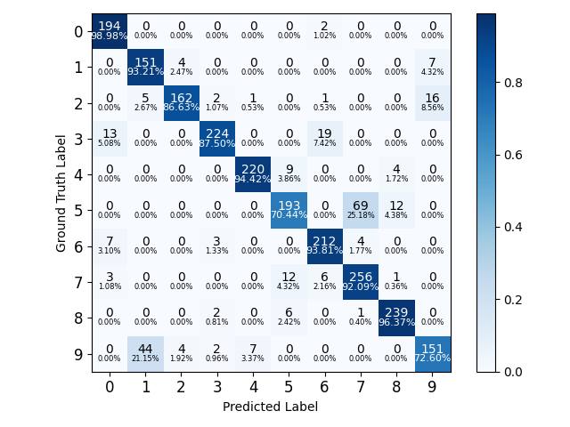
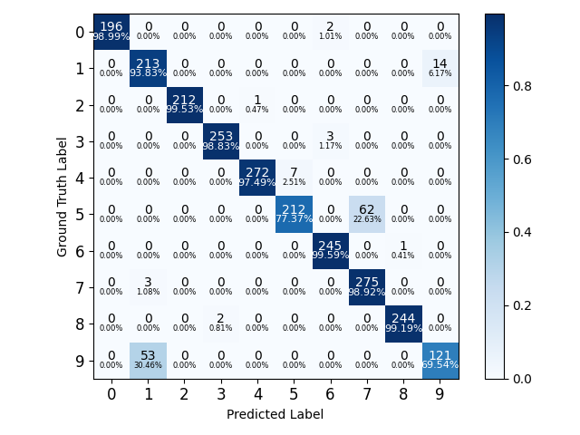

## Dataset

https://zenodo.org/records/4477542#.Y0DhB3ZByMo	TAU  
https://www.crcv.ucf.edu/research/data-sets/ucf101/	UCF101

## Result
93.1% on TAU2021  
95.0% on UCF  

### Confusion matrix  
audio  branch  
  
visual  branch  
  
early fusion  
  
GCN  
  
SAGCN(Ours)  
  

